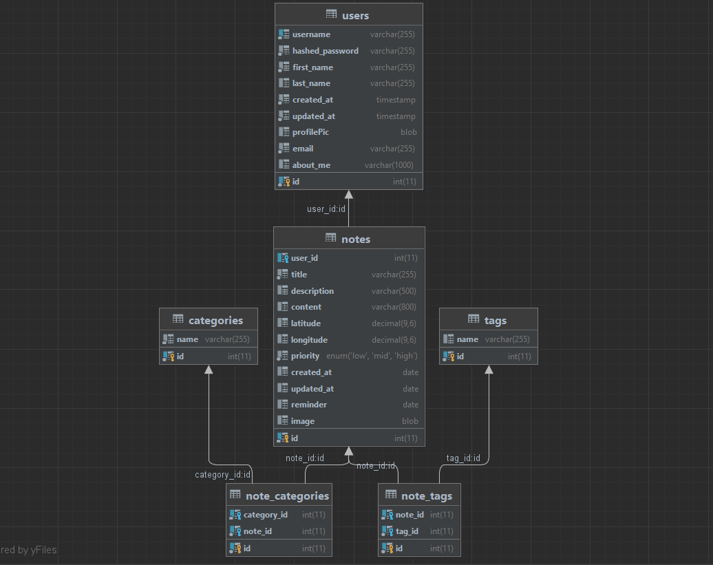

# KEEP

The website is a virtual notepad for users to create, manage, and modify their personal memory.

## Features
| Feature | Description                |
| :-------- | :------------------------- |
| `Registeration` | create account for the website|
| `Login/Signout` | log in and sign out from the website|
| `Manage profile` | update profile information |
| `Manage note` | create, view, edit, delete note |
| `Search` | search the note from the selection |
| `Reminder` | set the reminder for the note |
| `Past Memories` | view notes from the past |
| `Theme Change` | change the theme of the website |

## Stack Technologies
    - Frontend: React.js
    - Backend: Node.js with Express.js
    - Database: MariaDB/MySQL2

## Database Schema


## To run the frontend and backend
Frontend
```bash
  npm run client
```
Backend
```bash
  npm run server
```

## API endpoints

### Log in

URL
`POST /login`

#### Request Body

| Parameter | Type     | Description                |
| :-------- | :------- | :------------------------- |
| `usernameOrEmail` | `string` | username or email address |
| `password` | `string` | password | 

Example

```
{
  email: "natthanon4847@gmail.com",
  password: "Non12345"
}
```
#### Success

`200` success

| Parameter | Type     | Description                |
| :-------- | :------- | :------------------------- |
| `success` | `boolean` | success status |
| `message` | `string` | login result |


Example

```
{
    message: "Login credential is correct";
    success: true;
}
```
### Register

URL
`POST /register`

#### Request Body

| Parameter | Type     | Description                |
| :-------- | :------- | :------------------------- |
| `email` | `string` | email address |
| `firstname` | `string` | firstname |
| `lastname` | `string` | lastname |  
| `password` | `string` | password | 
| `username` | `string` | username | 

Example

```
{
    email: "natthanon4847@gmail.com";
    firstname: "Natthanon";
    lastname: "Somroop";
    password: "Non12345";
    username: "nonsomroop";
}
```
#### Success

`200` success

| Parameter | Type     | Description                |
| :-------- | :------- | :------------------------- |
| `success` | `boolean` | success status |
| `message` | `string` | register result |


Example

```
{
    success: true,
    message: "User has been created",
}
```
### Authentication Check

URL
`POST /register`

#### Request cookies

| Parameter | Type     | Description                |
| :-------- | :------- | :------------------------- |
| `user` | `string` | token "user" in the cookies |


Example

```
{
    user: "eyJhbGciOiJIUzI1Ni...""
}
```
#### Success

`200` success

| Parameter | Type     | Description                |
| :-------- | :------- | :------------------------- |
| `success` | `boolean` | success status |
| `message` | `string` | Authentication status |


Example

```
{
    success: true,
    message: "User is logged in",
}
```

### Create note

URL `POST /create_note`

#### Request Body

The request body should contain the following parameters:

| Parameter  | Type     | Description                    |
| :--------- | :------- | :----------------------------- |
| `title`    | `string` | Title of the note              |
| `description` | `string` | Description or summary of the note |
| `latitude` | `number` | Latitude coordinate of the note's location (optional) |
| `longitude` | `number` | Longitude coordinate of the note's location (optional) |
| `createDate` | `string` | Date of creation in the format "YYYY-MM-DD" (optional) |
| `priority` | `string` | Priority level of the note (optional) |
| `reminder` | `string` | Reminder date in the format "YYYY-MM-DD" (optional) |
| `content`  | `string` | Content of the note            |

Example
```
 {
    title: "Example Note",
    description: "This is an example note",
    latitude: 37.7749,
    longitude: -122.4194,
    createDate: "2022-10-15",
    priority: "High",
    reminder: "2022-10-20",
    content: "Lorem ipsum dolor sit amet"
  }
```
#### Success

`200` success

| Parameter | Type     | Description                |
| :-------- | :------- | :------------------------- |
| `success` | `boolean` | success status |
| `message` | `string` | Create status |


Example

```
{
    success: true,
    message: "Note created successfully.",
}
```


### Show notes

URL `GET /shownote`

#### Request cookies

| Parameter | Type     | Description                |
| :-------- | :------- | :------------------------- |
| `user` | `string` | token "user" in the cookies |

Example

```
{
    user: "eyJhbGciOiJIUzI1Ni...""
}
```
#### Success

`200` success

| Parameter  | Type     | Description                    |
| :--------- | :------- | :----------------------------- |
| `title`    | `string` | Title of the note              |
| `description` | `string` | Description or summary of the note |
| `latitude` | `number` | Latitude coordinate of the note's location (optional) |
| `longitude` | `number` | Longitude coordinate of the note's location (optional) |
| `createDate` | `string` | Date of creation in the format "YYYY-MM-DD" (optional) |
| `priority` | `string` | Priority level of the note (optional) |
| `reminder` | `string` | Reminder date in the format "YYYY-MM-DD" (optional) |
| `content`  | `string` | Content of the note            |

Example

```
{
    {
        title: "Example Note",
        description: "This is an example note",
        latitude: 37.7749,
        longitude: -122.4194,
        createDate: "2022-10-15",
        priority: "High",
        reminder: "2022-10-20",
        content: "Lorem ipsum dolor sit amet"
    }
}
```
### Edit note

URL `PUT /create_note/:noteId`

#### Request Body

The request body should contain the following parameters:

| Parameter  | Type     | Description                    |
| :--------- | :------- | :----------------------------- |
| `noteId`    | `string` | note id             |
| `title`    | `string` | Title of the note              |
| `description` | `string` | Description or summary of the note |
| `latitude` | `number` | Latitude coordinate of the note's location (optional) |
| `longitude` | `number` | Longitude coordinate of the note's location (optional) |
| `createDate` | `string` | Date of creation in the format "YYYY-MM-DD" (optional) |
| `priority` | `string` | Priority level of the note (optional) |
| `reminder` | `string` | Reminder date in the format "YYYY-MM-DD" (optional) |
| `content`  | `string` | Content of the note            |

Example
```
 {
    title: "Example Note",
    description: "This is an example note",
    latitude: 37.7749,
    longitude: -122.4194,
    createDate: "2022-10-15",
    priority: "High",
    reminder: "2022-10-20",
    content: "Lorem ipsum dolor sit amet"
  }
```
#### Success

`200` success

| Parameter | Type     | Description                |
| :-------- | :------- | :------------------------- |
| `success` | `boolean` | success status |
| `message` | `string` | update status |


Example

```
{
    success: true,
    message: "Note updated successfully."
}
```
### Delete note

URL `DELETE /delete-note/:noteId`

#### Request Body

The request body should contain the following parameters:

| Parameter  | Type     | Description                    |
| :--------- | :------- | :----------------------------- |
| `noteId`    | `string` | note id             |


Example
```
 {
    noteId: "5"
  }
```
#### Success

`200` success

| Parameter | Type     | Description                |
| :-------- | :------- | :------------------------- |
| `success` | `boolean` | success status |
| `message` | `string` | delete status |


Example

```
{
    success: true,
    message: "Note deleted successfully.",
}
```